<div align="center">

# ✈️ preflight

**Stop burning tokens on vague prompts.**

A 24-tool MCP server for Claude Code that catches ambiguous instructions before they cost you 2-3x in wrong→fix cycles — plus semantic search across your entire session history, cross-service contract awareness, and 12-category scorecards.

[](https://www.typescriptlang.org/)
[](https://modelcontextprotocol.io/)
[](LICENSE)
[](https://www.npmjs.com/package/preflight-dev)
[](https://nodejs.org/)

[Quick Start](#quick-start) · [How It Works](#how-it-works) · [Tool Reference](#tool-reference) · [Configuration](#configuration) · [Scoring](#the-12-category-scorecard)

</div>

---

## What's New in v3.2.0

- **Unified `preflight_check` entry point** — one tool that triages every prompt and chains the right checks automatically
- **Smart triage classification** — routes prompts through a decision tree (trivial → ambiguous → multi-step → cross-service)
- **Correction pattern learning** — remembers past mistakes and warns you before repeating them
- **Cross-service contracts** — extracts types, interfaces, routes, and schemas across related projects
- **`.preflight/` config directory** — team-shareable YAML config for triage rules and thresholds
- **Trend & comparative scorecards** — weekly/monthly trend lines, cross-project comparisons, radar charts, PDF export
- **Cost estimator** — estimates token spend and waste from corrections

---

## The Problem

We built this after analyzing **9 months of real Claude Code usage** — 512 sessions, 32,000+ events, 3,200+ prompts, 1,642 commits, and 258 sub-agent spawns across a production Next.js/Prisma/Supabase app. The findings were brutal:

- **41% of prompts were under 50 characters** — things like `fix the tests`, `commit this`, `remove them`
- Each vague prompt triggers a **wrong→fix cycle costing 2-3x tokens**
- **~33K characters/day** duplicated from repeated context pastes
- **124 corrections logged** — places where Claude went the wrong direction and had to be steered back
- **94 context compactions** from unbounded session scope blowing past the context window
- Estimated **30-40% of tokens wasted** on avoidable back-and-forth

The pattern is always the same: vague prompt → Claude guesses → wrong output → you correct → repeat. That's your money evaporating.

## The Solution

24 tools in 5 categories that run as an MCP server inside Claude Code:

| Category | Tools | What it does |
|----------|-------|-------------|
| ✈️ **Preflight Core** | 1 | Unified entry point — triages every prompt, chains the right checks automatically |
| 🎯 **Prompt Discipline** | 12 | Catches vague prompts, enforces structure, prevents waste |
| 🔍 **Timeline Intelligence** | 4 | LanceDB vector search across months of session history |
| 📊 **Analysis & Reporting** | 4 | Scorecards, cost estimation, session stats, pattern detection |
| ✅ **Verification & Hygiene** | 3 | Type-check, test, audit, and contract search |

## Before / After

```
❌  "fix the auth bug"
     → Claude guesses which auth bug, edits wrong file
     → You correct it, 3 more rounds
     → 12,000 tokens burned

✅  preflight intercepts → clarify_intent fires
     → "Which auth bug? I see 3 open issues:
        1. JWT expiry not refreshing (src/auth/jwt.ts)
        2. OAuth callback 404 (src/auth/oauth.ts)
        3. Session cookie SameSite (src/middleware/session.ts)
        Pick one and I'll scope the fix."
     → 4,000 tokens, done right the first time
```

---

## Quick Start

### Option A: Claude Code CLI (fastest)

```bash
claude mcp add preflight -- npx tsx /path/to/preflight/src/index.ts
```

With environment variables:

```bash
claude mcp add preflight \
  -e CLAUDE_PROJECT_DIR=/path/to/your/project \
  -- npx tsx /path/to/preflight/src/index.ts
```

### Option B: Clone & configure manually

```bash
git clone https://github.com/TerminalGravity/preflight.git
cd preflight && npm install
```

Add to your project's `.mcp.json`:

```json
{
  "mcpServers": {
    "preflight": {
      "command": "npx",
      "args": ["tsx", "/path/to/preflight/src/index.ts"],
      "env": {
        "CLAUDE_PROJECT_DIR": "/path/to/your/project"
      }
    }
  }
}
```

Restart Claude Code. The tools activate automatically.

### Option C: npm (global)

```bash
npm install -g preflight-dev
claude mcp add preflight -- preflight-dev
```

---

## How It Works

### The Triage Decision Tree

Every prompt flows through a classification engine before any work begins. This is the actual decision tree from [`src/lib/triage.ts`](src/lib/triage.ts):

```mermaid
flowchart TD
    A[Prompt Arrives] --> B{Skip keyword?}
    B -->|Yes| T1[✅ TRIVIAL]
    B -->|No| C{Multi-step indicators?}
    C -->|Yes| MS[🔶 MULTI-STEP]
    C -->|No| D{Cross-service keywords?}
    D -->|Yes| CS[🔗 CROSS-SERVICE]
    D -->|No| E{always_check keyword?}
    E -->|Yes| AM1[⚠️ AMBIGUOUS]
    E -->|No| F{"< 20 chars + common cmd?"}
    F -->|Yes| T2[✅ TRIVIAL]
    F -->|No| G{"< 50 chars, no file refs?"}
    G -->|Yes| AM2[⚠️ AMBIGUOUS]
    G -->|No| H{Vague pronouns or verbs?}
    H -->|Yes| AM3[⚠️ AMBIGUOUS]
    H -->|No| CL[✅ CLEAR]

    style T1 fill:#2d6a4f,color:#fff
    style T2 fill:#2d6a4f,color:#fff
    style CL fill:#2d6a4f,color:#fff
    style AM1 fill:#e9c46a,color:#000
    style AM2 fill:#e9c46a,color:#000
    style AM3 fill:#e9c46a,color:#000
    style CS fill:#457b9d,color:#fff
    style MS fill:#e76f51,color:#fff
```



Each level triggers different tool chains:

| Level | What fires | Example prompt |
|-------|-----------|----------------|
| **Trivial** | Nothing — pass through | `commit` |
| **Clear** | File verification only | `fix null check in src/auth/jwt.ts line 42` |
| **Ambiguous** | Clarify intent + git state + workspace priorities | `fix the auth bug` |
| **Cross-service** | Clarify + search related projects + contracts | `add tiered rewards` |
| **Multi-step** | Clarify + scope + sequence + checkpoints | `refactor auth to OAuth2 and update all consumers` |

Additionally, **correction pattern matching** can boost any triage level. If your prompt matches 2+ keywords from a previously logged correction, it's bumped to at least `ambiguous` — even if it would otherwise pass through.

### Data Flow


### Session Data Structure

Claude Code stores session data as JSONL files:

```
~/.claude/projects/<encoded-path>/
├── <session-uuid>.jsonl              # Main session
├── <session-uuid>/
│   └── subagents/
│       └── <sub-uuid>.jsonl          # Sub-agent sessions
```

Each JSONL line is an event. The [session parser](src/lib/session-parser.ts) extracts **8 event types**:

| Event Type | Source | What it captures |
|-----------|--------|-----------------|
| `prompt` | `user` messages | What the dev typed |
| `assistant` | `assistant` messages | Claude's text response |
| `tool_call` | `assistant` tool_use blocks | Tool invocations (Read, Write, Bash, etc.) |
| `sub_agent_spawn` | Task/dispatch_agent tool_use | When Claude delegates to a sub-agent |
| `correction` | `user` messages after assistant | Detected via negation patterns (no, wrong, actually, undo…) |
| `compaction` | `system` messages | Context was compressed (session hit token limit) |
| `error` | `tool_result` with is_error | Failed operations |
| `commit` | git log integration | Commits made during session |

### LanceDB Schema

Events are stored in per-project [LanceDB](https://lancedb.github.io/lancedb/) databases with vector embeddings for semantic search:

```
~/.preflight/projects/<sha256-12-char>/
├── timeline.lance/       # LanceDB vector database
├── contracts.json        # Extracted API contracts
└── meta.json             # Project metadata

Table: events
├── id: string            (UUID)
├── content: string       (event text)
├── content_preview: string (first 200 chars)
├── vector: float32[384]  (Xenova/all-MiniLM-L6-v2) or float32[1536] (OpenAI)
├── type: string          (event type from above)
├── timestamp: string     (ISO 8601)
├── session_id: string    (session UUID)
├── project: string       (decoded project path)
├── project_name: string  (short name)
├── branch: string        (git branch at time of event)
├── source_file: string   (path to JSONL file)
├── source_line: number   (line number in JSONL)
└── metadata: string      (JSON — model, tool name, etc.)
```

The project registry at `~/.preflight/projects/index.json` maps absolute paths to their SHA-256 hashes.

### Contract Extraction

The [contract extractor](src/lib/contracts.ts) scans your project for API surfaces:

| Pattern | What it finds |
|---------|--------------|
| `export interface/type/enum` | TypeScript type definitions |
| `export function GET/POST/…` | Next.js API routes |
| `router.get/post/…` | Express route handlers |
| `model Foo { … }` | Prisma models and enums |
| OpenAPI/Swagger specs | Routes and schema components |
| `.preflight/contracts/*.yml` | Manual contract definitions |

Contracts are stored per-project and searched across related projects during cross-service triage.

---

## Onboarding a Project

Run `onboard_project` to index a project's history. Here's what happens:

1. **Discovers sessions** — finds JSONL files in `~/.claude/projects/<encoded-path>/`, including subagent sessions
2. **Parses events** — extracts the 8 event types from each session file (streams files >10MB)
3. **Extracts contracts** — scans source for types, interfaces, enums, routes, Prisma models, OpenAPI schemas
4. **Loads manual contracts** — merges any `.preflight/contracts/*.yml` definitions (manual wins on name conflicts)
5. **Generates embeddings** — local [Xenova/all-MiniLM-L6-v2](https://huggingface.co/Xenova/all-MiniLM-L6-v2) by default (~90MB model download on first run, ~50 events/sec) or OpenAI if `OPENAI_API_KEY` is set (~200 events/sec)
6. **Stores in LanceDB** — per-project database at `~/.preflight/projects/<sha256-12>/timeline.lance/`
7. **Updates registry** — records the project in `~/.preflight/projects/index.json`

No data leaves your machine unless you opt into OpenAI embeddings.

After onboarding, you get:
- 🔎 **Semantic search** — "How did I set up auth middleware last month?" actually works
- 📊 **Timeline view** — see what happened across sessions chronologically
- 🔄 **Live scanning** — index new sessions as they happen
- 🔗 **Cross-service search** — query across related projects

---

## Tool Reference

### ✈️ Preflight Core

| Tool | What it does |
|------|-------------|
| `preflight_check` | **The main entry point.** Triages your prompt (trivial → multi-step), chains the right checks automatically, matches against known correction patterns. Accepts `force_level` override: `skip`, `light`, `full`. |

### 🎯 Prompt Discipline

| Tool | What it does |
|------|-------------|
| `scope_work` | Creates structured execution plans before coding starts |
| `clarify_intent` | Gathers project context (git state, workspace docs, ambiguity signals) to disambiguate vague prompts |
| `enrich_agent_task` | Enriches sub-agent tasks with file paths, patterns, and cross-service context |
| `sharpen_followup` | Resolves "fix it" / "do the others" to actual file targets |
| `token_audit` | Detects waste patterns, grades your session A–F |
| `sequence_tasks` | Orders tasks by dependency, locality, and risk |
| `checkpoint` | Save game before compaction — commits + resumption notes |
| `check_session_health` | Monitors uncommitted files, time since commit, turn count |
| `log_correction` | Tracks corrections and identifies recurring error patterns |
| `check_patterns` | Checks prompts against learned correction patterns — warns about known pitfalls |
| `session_handoff` | Generates handoff briefs for new sessions |
| `what_changed` | Summarizes diffs since last checkpoint |

### 🔍 Timeline Intelligence

| Tool | What it does |
|------|-------------|
| `onboard_project` | Indexes a project's session history + contracts into per-project LanceDB |
| `search_history` | Semantic search with scope: current project, related, or all indexed projects |
| `timeline` | Chronological view of events across sessions |
| `scan_sessions` | Live scanning of active session data |

### 📊 Analysis & Reporting

| Tool | What it does |
|------|-------------|
| `generate_scorecard` | 12-category report card — session, trend (week/month), or cross-project comparative. Radar chart SVG, PDF or markdown. |
| `estimate_cost` | Token usage, dollar cost, waste from corrections, preflight savings |
| `session_stats` | Lightweight session analysis — no embeddings needed |
| `prompt_score` | Gamified A–F grading on specificity, scope, actionability, done-condition |

### ✅ Verification & Hygiene

| Tool | What it does |
|------|-------------|
| `verify_completion` | Runs type check + tests + build before declaring done |
| `audit_workspace` | Finds stale/missing workspace docs vs git activity |
| `search_contracts` | Search API contracts, types, and schemas across current and related projects |

---

## The 12-Category Scorecard

`generate_scorecard` evaluates your prompt discipline across 12 categories. Each one measures something specific about how you interact with Claude Code:

| # | Category | What it measures | How it scores |
|---|----------|-----------------|---------------|
| 1 | **Plans** | Do you start sessions with a plan? | % of sessions where the first 3 prompts include file references and >100 chars |
| 2 | **Clarification** | Are your prompts specific? | % of user prompts containing file paths or specific identifiers |
| 3 | **Delegation** | Are sub-agent tasks well-defined? | % of sub-agent spawns with >200 char descriptions |
| 4 | **Follow-up Specificity** | Do follow-ups reference files? | % of follow-up prompts (after assistant response) with file refs or ≥50 chars |
| 5 | **Token Efficiency** | How many tool calls per file? | Ratio of tool_calls to unique files touched (ideal: 5-10 calls/file) |
| 6 | **Sequencing** | Do you stay focused or context-switch? | Topic switch rate — how often prompts jump between different directory areas |
| 7 | **Compaction Management** | Do you commit before compaction? | % of compaction events preceded by a commit within 10 messages |
| 8 | **Session Lifecycle** | Do you commit regularly? | % of sessions with healthy commit frequency (every 15-30 min) |
| 9 | **Error Recovery** | How quickly do you recover from mistakes? | Correction rate (% of messages) + recovery speed (within 2 messages) |
| 10 | **Workspace Hygiene** | Do you maintain workspace docs? | Baseline 75 + bonus for sessions referencing `.claude/` or `CLAUDE.md` |
| 11 | **Cross-Session Continuity** | Do new sessions read context? | % of sessions where first 3 tool calls read project context docs |
| 12 | **Verification** | Do you test at the end? | % of sessions that ran tests/build/lint in the final 10% of events |

### Report Types

| Type | What you get |
|------|-------------|
| **Scorecard** | Single-period snapshot with 12 categories, radar chart, best/worst highlights |
| **Trend** | Weekly or monthly trend line, per-category movement, top 3 improvement areas, best/worst prompts |
| **Comparative** | Side-by-side across multiple projects, cross-project pattern detection |

All three support **PDF export** (requires Playwright) and **historical baselines** that track your rolling averages over time.

---

## Cross-Service Awareness

Preflight understands that microservices share contracts. When your prompt mentions a keyword from a related project, triage escalates to `cross-service` and searches those projects for relevant context.

### Setup

**Option 1: `.preflight/config.yml`** (recommended — committed to repo)

```yaml
# my-api/.preflight/config.yml
related_projects:
  - path: /Users/jack/Developer/auth-service
    alias: auth-service
  - path: /Users/jack/Developer/notifications
    alias: notifications
  - path: /Users/jack/Developer/shared-types
    alias: shared-types
```

**Option 2: Environment variable** (per-user)

```bash
PREFLIGHT_RELATED=/path/to/auth-service,/path/to/notifications
```

### How it works

1. You type: `"add rewards tier validation"`
2. Triage detects `rewards` matches `always_check` keyword → `ambiguous`
3. Cross-service keywords (`auth`, `notification`) don't match, but if you had typed `"add rewards with auth check"` → `cross-service`
4. Preflight searches related projects' LanceDB indexes and contract registries
5. Returns relevant types, interfaces, and routes from those projects
6. You get context like: "auth-service has `interface AuthToken { userId, tier, permissions }` and `POST /api/validate-tier`"

This prevents the common failure mode: changing a shared type in one service and forgetting the consumers.

---

## Configuration Reference

### `.preflight/config.yml`

Drop this in your project root. Every field is optional — defaults are sensible.

```yaml
# Profile controls overall verbosity
# "minimal" — only flag ambiguous+, skip clarification detail
# "standard" — default behavior
# "full" — maximum detail on every non-trivial prompt
profile: standard                          # type: "minimal" | "standard" | "full"

# Related projects for cross-service awareness
related_projects:                          # type: RelatedProject[]
  - path: /absolute/path/to/service        #   path: string (absolute)
    alias: service-name                    #   alias: string (used in output + triage matching)

# Behavioral thresholds
thresholds:
  session_stale_minutes: 30                # type: number — warn if no activity for this long
  max_tool_calls_before_checkpoint: 100    # type: number — suggest checkpoint after N tool calls
  correction_pattern_threshold: 3          # type: number — min corrections to form a pattern

# Embedding configuration
embeddings:
  provider: local                          # type: "local" | "openai"
  openai_api_key: sk-...                   # type: string — only needed if provider is "openai"
```

### `.preflight/triage.yml`

Controls the triage classification engine.

```yaml
# Keywords that control routing
rules:
  # Prompts containing these → always at least AMBIGUOUS
  always_check:                            # type: string[] — default: [rewards, permissions, migration, schema]
    - rewards
    - permissions
    - migration
    - schema

  # Prompts containing these → TRIVIAL (pass through)
  skip:                                    # type: string[] — default: [commit, format, lint]
    - commit
    - format
    - lint

  # Prompts containing these → CROSS-SERVICE
  cross_service_keywords:                  # type: string[] — default: [auth, notification, event, webhook]
    - auth
    - notification
    - event
    - webhook

# How aggressively to classify
# "relaxed" — more prompts pass as clear
# "standard" — balanced
# "strict" — more prompts flagged as ambiguous
strictness: standard                       # type: "relaxed" | "standard" | "strict"
```

### `.preflight/contracts/*.yml`

Manual contract definitions that supplement auto-extraction:

```yaml
# .preflight/contracts/api.yml
- name: RewardsTier
  kind: interface
  description: Reward tier levels and their perks
  fields:
    - name: tier
      type: string
      required: true
    - name: multiplier
      type: number
      required: true
    - name: perks
      type: string[]
```

### Environment Variables

| Variable | Description | Default |
|----------|-------------|---------|
| `CLAUDE_PROJECT_DIR` | Project root to monitor | **Required** |
| `OPENAI_API_KEY` | OpenAI key for embeddings | Uses local Xenova |
| `PREFLIGHT_RELATED` | Comma-separated related project paths | None |
| `EMBEDDING_PROVIDER` | `local` or `openai` | `local` |
| `PROMPT_DISCIPLINE_PROFILE` | `minimal`, `standard`, or `full` | `standard` |

Environment variables are **fallbacks** — `.preflight/` config takes precedence when present.

---

## Embedding Providers

| Provider | Setup | Speed | Dimensions | Quality | Privacy |
|----------|-------|-------|-----------|---------|---------|
| **Local (Xenova)** | Zero config | ~50 events/sec | 384 | Good | 100% local |
| **OpenAI** | Set `OPENAI_API_KEY` | ~200 events/sec | 1536 | Excellent | API call |

First run with local embeddings downloads the [Xenova/all-MiniLM-L6-v2](https://huggingface.co/Xenova/all-MiniLM-L6-v2) model (~90MB). After that, everything runs offline.

---

## Architecture

```mermaid
flowchart TB
    CC[Claude Code] <-->|MCP Protocol| PS[preflight server]
    
    PS --> PC[✈️ Preflight Core]
    PS --> DT[🎯 Discipline Tools]
    PS --> TL[🔍 Timeline Tools]
    PS --> AN[📊 Analysis Tools]
    PS --> VR[✅ Verify Tools]

    PC --> TE[Triage Engine]
    DT --> PL[Pattern Learning]
    TL --> LDB[(LanceDB\nper-project)]
    AN --> SCE[Scorecard Engine]

    TE -.-> CFG[".preflight/\nconfig.yml\ntriage.yml\ncontracts/"]
    LDB --> SP[Session Parser]
    SP --> JSONL["~/.claude/projects/\n(session JSONL files)"]

    style CC fill:#264653,color:#fff
    style PS fill:#2a9d8f,color:#fff
    style PC fill:#e76f51,color:#fff
    style DT fill:#e9c46a,color:#000
    style TL fill:#457b9d,color:#fff
    style AN fill:#6a4c93,color:#fff
    style VR fill:#2d6a4f,color:#fff
    style LDB fill:#1d3557,color:#fff
```



### Per-Project Data Layout

```
~/.preflight/
├── config.json                           # Global config (embedding provider, indexed projects)
└── projects/
    ├── index.json                        # Registry: path → { hash, onboarded_at }
    ├── a1b2c3d4e5f6/                     # SHA-256(project_path)[:12]
    │   ├── timeline.lance/               # LanceDB vector database
    │   ├── contracts.json                # Extracted API contracts
    │   ├── meta.json                     # Event count, onboard timestamp
    │   └── baseline.json                 # Historical scorecard averages
    └── f6e5d4c3b2a1/
        └── ...                           # Another project
```

---

## Contributing

This project is young and there's plenty to do. Check the [issues](https://github.com/TerminalGravity/preflight/issues) — several are tagged `good first issue`.

PRs welcome. No CLA, no bureaucracy. If it makes the tool better, it gets merged.

### Development

```bash
git clone https://github.com/TerminalGravity/preflight.git
cd preflight
npm install
npm run build
npm test
```

### Project Structure

```
src/
├── index.ts                 # MCP server entry point
├── lib/
│   ├── triage.ts            # Prompt classification engine
│   ├── session-parser.ts    # JSONL session file parser
│   ├── timeline-db.ts       # LanceDB operations
│   ├── contracts.ts         # Contract extraction & search
│   ├── patterns.ts          # Correction pattern learning
│   ├── config.ts            # .preflight/ config loading
│   ├── embeddings.ts        # Embedding provider abstraction
│   ├── state.ts             # Persistent state (logs, patterns)
│   ├── git.ts               # Git operations
│   └── files.ts             # File discovery
└── tools/
    ├── preflight-check.ts   # Unified entry point
    ├── generate-scorecard.ts # 12-category scoring + trends
    └── ...                  # One file per tool
```

## License

MIT — do whatever you want with it.
